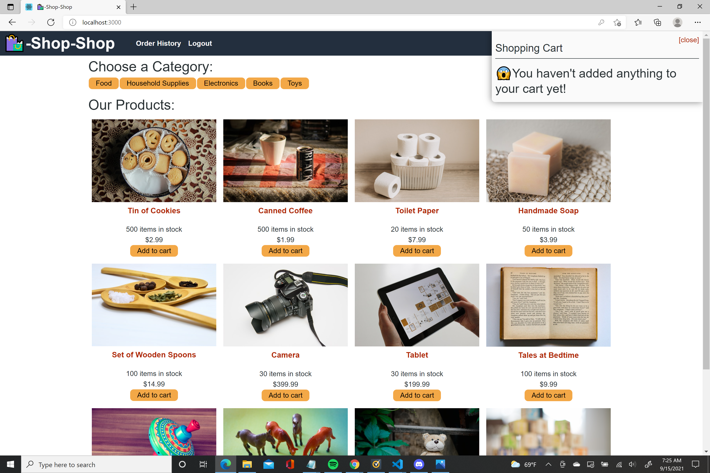
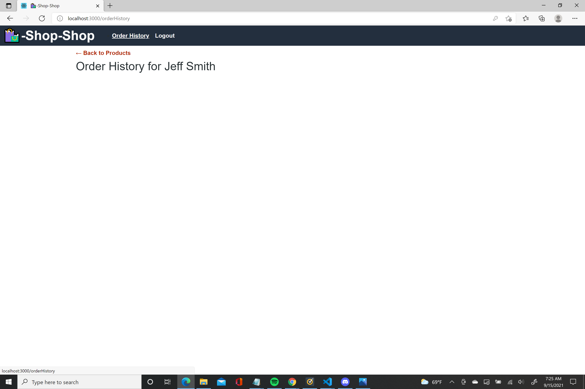
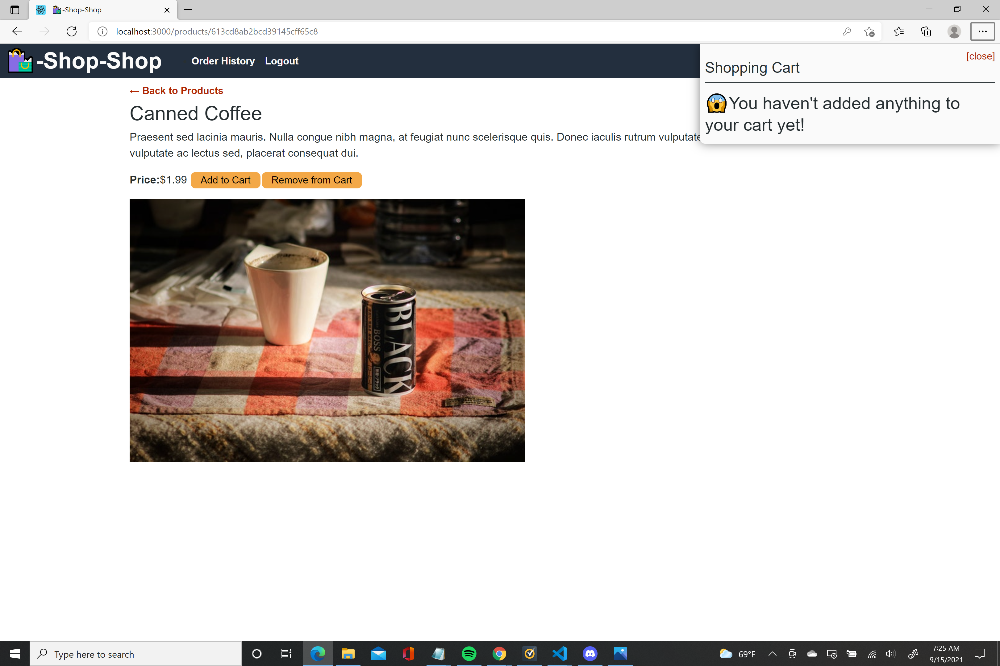
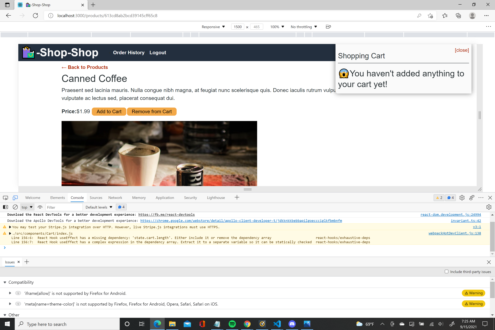

# ReduxStore
Our challenge was to refactor the e-commerce website from the module project so that it uses REDUX. The website called Shop Shop allows users to shop for various products, add those products to a shopping cart and adjust its quantity.

## Technologies Used-
1. React
2. Node.js
3. GraphQL
4. Apollo Server
5. MongoDB

## Screenshots-

## Deployed link-
https://rohannj1993.github.io/ReduxStore/

## My Repository-
https://github.com/rohannj1993/ReduxStore

## My Github profile-
https://github.com/rohannj1993